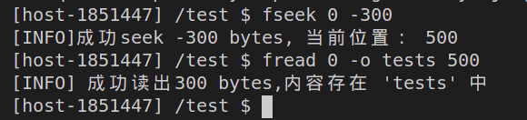
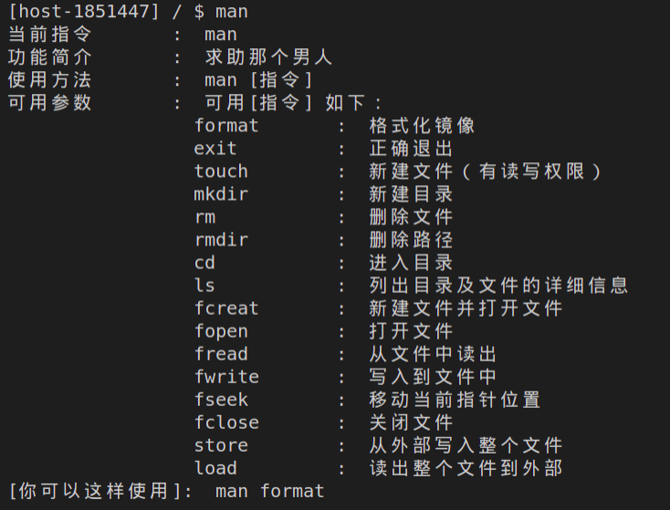

# 操作系统课程设计报告

一个简单的类Unix的单进程文件系统

姓名：郑秋实 班级：计算机（1）班 学号：1851447

指导老师：方钰

## 目录

[TOC] 

## 一、需求分析

#### 1.1 构造一个类UNIX二级文件系统

​		使用一个普通的大文件（如C:\myDisk.img ，称之为一级文件） 来模拟`UNIX V6++`的一个文件卷（把一个大文件当一张磁盘用）。需要利用`linux`的`fopen`和`mmap`等系统调用来创建文件、映射内存空间，并进行内容的写入；单个盘块大小为`512`字节；

#### 1.2 定义磁盘文件结构

​		用于进行文件的存储、文件类型的指定。

- 定义自己的磁盘文件结构：包括盘块的划分，盘块的分配（分配给`superblock`、内存`inode`、外存数据块）；
-  `SuperBlock` 结构：用于管理空闲的`inode`，管理空闲的数据块，从而宏观对`inode`进行管理；
-  磁盘` Inode` 节点结构，包括：索引结构（用于存放文件具体内容的一张混合索引表）及逻辑块号到物理块号的映射关系（保证顺序逻辑块可以对应到不连续的外存数据块）；分配与回收算法设计与实现（主要通过`superblock`进行相应操作）；
-  文件数据区的分配与回收算法设计与实现（应该如何通过`inode`的索引结构及映射关系进行数据块的分配与回收）；

#### 1.3 文件目录结构

​		用于进行目录结构的确定，同时可以进行指定目录的检索与搜索。

-  目录文件结构：存放目录项的自身信息以及与对应`inode`节点之间的对应关系；
- 目录检索算法的设计与实现：需要对文件类型为文件夹的`inode`的`addr`数据块区域解译为目录项并进行内容的展示；

#### 1.4 文件打开结构

​		用于进行文件的打开，从而供用户使用，用户可以进行相应的读写操作。

- 文件打开表：包括`File`结构的分配与释放。用于记录当前系统打开的文件清空；
- 文件打开`File`结构：包括当前文件的权限、与`inode`的映射关系以及当前读写的操作状态；

#### 1.5 磁盘高速缓存（选作）

​		针对读写操作，建立了一个缓存队列，以达到减少I/O操作次数的目的，加快系统运行速度。

- 缓存控制块结构：队列的指针勾连关系以及与对应数据块盘号的对应关系；
- 自由队列与设备队列的操作：包括缓存控制块的读出、写入以及这两个操作所包含的子步骤实现；

#### 1.6 文件操作接口

​		最后需要完成一个供用户进行自定义操作的界面。即通过命令行的方式，进行文件的创建、删除、查询、修改目录、读写等操作；

​		需要包含以下功能命令：

```c++
format       :  格式化镜像 
exit         :  正确退出 
touch        :  新建文件（有读写权限） 
mkdir        :  新建目录 
rm           :  删除文件 
rmdir        :  删除路径 
cd           :  进入目录 
ls           :  列出目录及文件的详细信息 
fcreat       :  新建文件并打开文件 
fopen        :  打开文件 
fread        :  从文件中读出 
fwrite       :  写入到文件中 
fseek        :  移动当前指针位置 
fclose       :  关闭文件 
store        :  从外部写入整个文件 
load         :  读出整个文件到外部 
man          :  读出整个文件到外部 
```

#### 1.7 开发环境

考虑到`Unix` \\`Linux`环境会更加贴合操作系统的设计背景，同时调用相应的系统调用会比较方便，所以我们选择在`Linux`下进行开发，采用`Ubuntu18.04`发行版，具体参数如下：

```bash
Linux version 4.15.0-143-generic (buildd@lcy01-amd64-001) (gcc version 7.5.0 (Ubuntu 7.5.0-3ubuntu1~18.04)) #147-Ubuntu SMP Wed Apr 14 16:10:11 UTC 2021
```

最终使用`g++ mingw`进行交叉编译生成可以直接在`win`上运行的`exe`

## 二、概要设计

### 3.1 模块划分


- Kernel：是本操作系统的核心模块。

  - 将`SuperBlock`、文件系统等文件系统的核心实现部分进行了简单封装。
  - 该模块被声明为类的静态遍历，同时通过类的静态调用方法，可以被所有的子成员部分访问。 
  - 同时也负责镜像文件的创建、挂载和释放。
  - 调用相应的功能函数。
  - 最后会向`shell`反馈读写的结果。

- Shell：实现命令行输入的操作界面。

  - 将用户输入进行分解与提取，并判断命令输入的正确性。
  - 确定执行的命令，并调用Kernel执行相应操作。

  - 向用户反馈当前指令的执行情况。

### 3.2 核心模块划分

​		下面我们对Kernel进行继续的划分分析，模块联系图如下所示：


##### 六大核心模块

- DiskDriver ：实际磁盘管理模块，涉及真正数据盘块的物理存储（外存数据块），并将修改作用到镜像文件。

  成员：

  > - FileFd disk_img_fd：通过`linux`系统调用打开的`fd`，需要利用它来关闭；
  > - DiskBlock *disk_mem_addr：当前镜像文件的起始地址；

  外部调用：

  > - VFS_Status mountImg() / unmountImg()：挂载与卸载镜像；
  > - DiskBlock *getBlk(int block_num)：获得指定盘块号的物理盘块；
  > - void readBlk(int block_num, DiskBlock *dst)：读出指定盘块号的物理盘块；
  > - void writeBlk(int block_num, const DiskBlock &blk)：写入到指定盘块号的物理盘块；
  > - DiskBlock *getDiskMemAddr()：获得当前镜像文件的起始地址；

- InodeCache  ： 内存Inode区，用于临时存放inode节点，从而不用到外存重新载入diskInode，减少I/O操作以加快处理速度。

  成员：

  > - Inode inode_cache_area[]：内存inode数据区，每一个单元用于存放具体的inode信息；

  外部调用：

  > - Inode *getInodeByID(int inode_id)：查看当前内存区是否存在指定InodeID的inode；
  > - int writeBackInode()：将内存中的inode全部写回磁盘中。


- SuperBlock ：用于管理空闲的`inode`，管理空闲的数据块，从而宏观对`inode`进行管理；

  成员：

  > -  InodeId s_inode[]：空闲inode栈，用于管理inode的分配和回收
  > - InodeId s_free[]：空闲磁盘块栈，用于管理磁盘块的分配和回收

  外部调用：

  > - BlkId balloc()：申请一个盘块；
  > - void bfree(BlkId blk_num)：释放指定号的盘块，并重新压回栈；
  > - void ballocCeratin(BlkId blk_num)：申请指定号的盘块；
  > - InodeId ialloc()：从栈中申请一个空闲的`inode`；
  > - void ifree(InodeId inode_id)：释放一个指定号的`inode`并重新压回栈；

- VFS ：我们的虚拟文件系统，用于处理对文件目录关系的处理。

  成员：

  - 无

  外部调用：

  > - DiskInode getDiskInodeById(int inode_id)：获得指定inodeID所在的盘块号；
  > - void writeBackDiskInode(int inode_id, DiskInode disk_inode)：将指定的inodeID重新写回其所在的盘块号；
  > - InodeId locateInode(const myPath& path)：根据用户输入的操作地址，来寻找其对应的inodeID；
  > - InodeId locateParDir(const myPath& path)：根据用户输入的操作地址，来寻找其对应地址的父地址的inodeID；

- OpenFileTable：记录所有已打开文件的情况，同时进行文件打开与关闭时文件描述符的申请与回收；

  成员：

  > - File m_File[]： 记录所有已打开文件的情况；

  外部调用：

  > - File *FAlloc()：为新打开的文件申请空间；
  > - void CloseF(File *pFile)：关闭并回收相应的文件；

- BufferCache ：  针对读写操作，建立了一个缓存队列，以达到减少I/O操作次数的目的，加快系统运行速度。

  成员：

  > Buf bFreeList：缓存队列，15个Buf首尾相互连接。
  >
  > Buf m_Buf[]：每个缓冲块的结构，和具体的数据buffer一一对应，记录了当前对应diskBlock的位置（物理块号）。
  >
  > DiskBlock Buffer[]：每个缓冲块指向块的具体内容。

  外部调用：

  >   Buf *Bread(int blk_num)：将指定物理盘块号的DiskBlock整个读入缓存队列中；
  >
  >   void Bwrite(Buf *bp)：将指定的缓冲块，重新写回磁盘中（通过）；
  >
  >   void Bdwrite(Buf *bp)：延迟写磁盘块；
  >
  >   void Bflush()：将当前队列中所有置延迟写的缓冲块全部输出到磁盘；
  >
  >   void Brelse(Buf *bp)：释放该缓冲块，即清除标志位并将当前缓冲块移动到队列尾部；
  >
  >   void getFetched(Buf *bp)：从自由队列中抽出该缓冲块；
  >
  >   void Bclear(Buf *bp)：清空该缓冲块的内容；

除了这六大核心模块，还涉及到一些基本结构体：

- Buf：缓存块的基本单位之一，记录了当前缓存块的基本信息；
- Inode：记录了缓存区中节点的基本情况，如需要记录当前是否被修改、文件引用次数等信息...；
- DiskInode：记录了磁盘中节点的基本情况（比Inode要少很多成员）；
- DiskBlock：磁盘上的基本存储单位；
- DirectoryEntry： 记录目录与对应的inode编号；
- User：记录当前用户的当前路径情况；
- File：记录某文件打开；
- myPath：用于解析用户输入终端的操作路径。

## 三、详细设计

#### 1.1 构造一个类UNIX二级文件系统

我们的文件系统本质上就是一个大文件。这里我们采用`linux`下的系统调用进行相应文件的创建、映射与修改。

通过`open`进行镜像文件的创建或打开。如果文件是首次创建，则还需要通过`lseek`和`ftruncate`进行文件大小的修改。

创建完之后，通过`mmap`，将该镜像文件的首地址映射到`DiskDriver::disk_mem_addr`，之后当我们需要写回或读出时，就可以对该地址结合使用`seek`和`read`或`write`进行相应操作。

#### 1.2 定义磁盘文件结构

##### 定义自己的磁盘文件结构

首先我定义自己的盘块大小为`512 Byte`。`SuperBlock`占2个盘块，`InodeBlock`占1022个盘块，`diskBlock`为剩下的盘块。总共定义盘块数`2*1024*64`个，总大小为`64*1024*1024`Byte，约64M；


#####  SuperBlock 结构

​		用于管理空闲的`inode`，管理空闲的数据块，从而宏观对`inode`进行管理；

##### 磁盘 Inode 节点结构

- 索引结构

  ​		参考电子教案与`Unix V6++`，我们采用混合索引结构作为其物理结构。即保证`diskINode`和`Inode`的`addr[n]`成员可以记录第n个逻辑块所占据的物理盘块号。

  ​		即按照逻辑块号的使用情况，我们将文件分为三类：

  > 小型文件：数据长度是0 ~ 6个数据块之间的
  >
  > 大型文件：数据长度是7 ~ （6 + 128 * 2）个数据块之间的
  >
  > 巨型文件：数据长度是（128 * 2 + 7）~ （128 * 128 * 2 + 128 * 2 + 6）

  ​		稍后我们会介绍，他是如何进行文件内容的分配填充与回收删除的。


- 逻辑块号到物理块号的映射关系

  ​		因为`SuperBlock`对数据块管理的原因，对于一个Inode来说，它的逻辑内容往往不能够对应于一块连续的内存；同时因为多级索引结构的存在，我们需要建立一套逻辑块号到物理块号的映射关系！

  ​		首先，我们需要给定某一Inode的逻辑块号（不妨设为`lbn`），然后就这个逻辑块号的大小进行判断：

  ​		如果以及超过了巨型文件的最大块数，直接报错；

  ​		如果是小型文件的范围之内（`lbn` 为0-5），直接取出其对应的物理块号，进行物理块号的获取。如果是零，说明之前尚未分配相应的物理块，则需要进行分配，即此时是一个文件内容进行扩充的过程！否则，说明以及分配过了，直接取出就行；

  ​		（扩充步骤如下，第一步，从superblock中得到一块空闲的物理块（块号为`phy_blk_id`），然后通过`GetBlk`向缓存队列索要相应块号内容的缓存块（至于缓存队列是如何操作的，后续会详述）。将该块设置延迟写（为了保证内容可以得到初始化），并将该块号存到逻辑块中！）

  ​		如果不是小型文件，就需要锁定其间接索引块。如果是大型文件，使用以下公式进行一次间接索引的计算
  $$
  index = (lbn - 6) / 128 + 6
  $$
  然后进行和小型文件一样的物理块号的获取，先得到一次索引块；然后对一次索引块再次获取物理块号，从而真正获得数据块！

  ​		如果是巨型文件就使用以下公式进行二次间接索引的计算:
  $$
  index = (lbn - 262) / 128 \% 128
  $$
  ​		通过一轮或两轮的获取，我们得到了一张一次索引表或者是二次索引表，然后根据相应数值去得到索引表中的项即可！

  ​		流程图如下所示：

  

  ​		整个过程具体实现在`int Inode::Bmap(int lbn)`中。

- 分配与回收算法设计与实现

  ​		Inode的分配与回收主要由superblock进行管理。这里我与Unix VC++类似，设置一个大小为100的栈，需要分配就出栈，然后当栈内内容不足时，再重新读入100个新的inode；需要回收就入栈， 栈内已满，不再压入即可。

  ​		具体的分配算法实现如下：
  
  ​		当栈为空时，我们依次去遍历存储inode盘块的各个inode节点（通过缓冲队列去要盘块，然后通过缓冲块的数据块信息，按照inode项去遍历）。
  
  ​		对于每一个inode节点来说，如果他的d_mode值为零并且不在内存`InodeCache`中，说明该inode是空闲的，选择压入inode栈中；否则，释放回缓冲队列并继续遍历下一块。一直进行这个过程，直到inode栈又被装满了！
  
  ​		以下是对应的流程示意图：
  
  
  
  ​		而具体分配被调用的地方就是上述`Bmap`里头对Superblock的申请。
  
  ​		回收算法比较简单这里就不在赘述！
  
  ​		以上算法实现在`InodeId SuperBlock::ialloc()`和`void SuperBlock::ifree(InodeId inode_id)`；

##### 文件数据区分配与回收算法设计与实现

###### 初始化

对于数据盘块，像inode节点管理一样，我们采用栈的数据结构。但是管理方式采用了下图中的分组链接式。这也就需要，在镜像初始化时，就将所有盘块通过以下方式串联起来。（不过由于是栈，所以应该将下图倒过来看


具体实现算法如下：

​		现在需要遍历所有的数据盘块，当盘块栈未满，就直接将相应的数据盘块号压栈即可；

​		当盘块栈已满，就需要将当前栈的盘块数以及所有内容压入一个临时数据块，然后清空当前盘块栈后（将盘块数置零即可），再压入这个新的临时块即可。从而保证了他们的连接关系！

具体流程图如下：


​		

以上算法实现在`void VFS::format()`中。

###### 分配

分配的基本思想就是从数据栈中拿出数据块，用于新文件的写入；但如果数据栈已空，那就需要根据成组链接法，将栈底的块拿出，其中的值分别代表了上一轮数据栈的情况，用之直接复原数据块即可。

具体流程图如下：


以上算法是实现在`InodeId SuperBlock::balloc()`

接下来是一个引用到分配算法的文件扩充场景。可能存在以下场景，即当我初次建立文件时，没有写入内容。但之后，随着`fwrite`的进行，新的内容会被写入，即其大小应当被扩充。

这个分配的过程体现在`int Kernel::write(int, uint8_t *, int)`这个API中。我们现在只关注写入扩充的部分，等会儿会介绍在此之前的文件检索。

首先明确，写入过程是一个循环的过程，即每次最多可以写一个盘块这么多的数据。根据当前打开的文件描述信息，我们可以知道文件的读写指针偏移量，然后根据这个偏移量，计算出当前文件的逻辑块。然后调用`Bmap`去定位物理块。注意，当查不到时，`Bmap`就会为我们分配逻辑块（这里调用了`ballc`）！

得到逻辑块后，进行`memcpy`进行写入并置延迟写即可！

可以看到，文件数据区的分配在`Bmap`就已经为我们实现了！

###### 回收

回收的思想与初始化的类似，因此不在赘述！

具体实现在`void SuperBlock::bfree(BlkId blknum)`。

当我们删除一个大文件时，不能只是删除这个`inode`还需要删除相应的`addr`的值！但由于其涉及到了混合索引的结构，所以我们需要进行`Bmap`的逆操作。

我们需要从后往前进行删除，如果是巨型文件范围之内，就需要先获取二级检索表（通过`Bread`向`superblock`获取相应的`diskInode`，这个过程后面会详述！），然后从后往前遍历这个表，依次获取对应的一级检索表。然后从后往前获取文件内容，并通过`superblock`的`bfree`进行释放！

​		流程图如下所示：

​                                      	

​	具体实现在`void Kernel::relseBlock(Inode *delete_inode)`中。

#### 1.3 文件目录结构

##### 目录检索算法的设计与实现

​		效仿Unix V6++，我们建立如下目录树。思想如下：如果一个inode的标志是文件夹，那么我们将这个inode对应的数据块使用`DirectoryEntry`进行填充。


###### 新建与删除		

​		在新建与删除之前，我们需要获取需要查找的`inode`通过它的`InodeID`，需要从`InodeCache`检索这个节点。

​		首先，我们先遍历`InodeCach`中的所有缓存内容，如果发现存在内存中，就直接返回相应的内容。

​		不然，不在内存，我们就先去外存中找（该过程仍然通过缓存队列来实现），如果找到了，就返回；如果找不到，缓存队列会帮我们返回一个新inode节点，并并加入到内存inode中(具体实现在`addInodeCache`)。

​		外存找到之后，就会通过`getFreeINode`，在缓存中找一个空闲inode，从而加载到内存中！这整个过程调用了若干不同模块的函数，耦合性较高。

​		下面是流程图：


​		具体实现在`Inode *InodeCache::getInodeByID(int inode_id)`中。

​		如果发现此时内存中已满，则需要进行内存的替换（随机替换即可...）如果被替换者内容被修改，则需要重新回写到相应的DiskInode上！（具体实现在`writeBackDiskInode`，就是通过inodeID确定应该落到的盘块号，然后借助缓存队列进行读取，读到后将相应内容直接修改到对应的diskInode处）

​		当我们得到了这块目录的inode节点后，取出其addr对应的物理块内容，然后对物理块内容以`DirectoryEntry`为单位进行内容的读出或者写入（添加目录项或者删除目录项）。

###### 检索

​		在成功地建立了目录树之后，我们可能需要对特定节点进行检索与定位操作。而该操作又会涉及到相对路径与绝对路径的定位。

​		首先，我们将输入目标地址进行剖析，生成一个`myPath`结构体，这个结构以`/`为分隔符，将一串字符路径分割成若干个递进的目录（保证正确性，即最后一项是文件，其他全是目录）。

​		如果需要定位目标文件，我们首先需要找到它所在的文件夹，遍历这个文件夹的addr对应的diskinode，这上面存放着所有该文件夹下的内容，即每一个`DirectoryEntry`，应该包含我们的目标检索文件！（这个过程被封装为`InodeId VFS::getInodeIdInDir(InodeId par_inode_id, FileName fileName)`）

​		所以我们试图获取该目标地址的父目录。 这一点不难实现，只需要遍历所有递进的目录，遍历其diskinode，依次比较所有`DirectoryEntry`，然后进入我们期望的即可。

​		最后再一次调用`getInodeIdInDir`既可以获取目标inodeID！通过`getInodeByID`获取对应的inode节点！

​		这是相应`getInodeIdInDir`实现的流程图：


​		以上函数实现于`InodeId VFS::locateInode(const myPath& path)`。

#### 1.4 文件打开结构

- 文件打开`File`结构
- 打开与关闭时`File`结构的分配与回收

###### 打开

​		文件打开时，`OpenFileTable`会为之分配一个空闲的`File`项（就是顺序遍历`File`数组）；

​		然后获取当前用户，在当前用户的打开文件描述符(`OpenFiles::AllocFreeSlot`)中分配一个`fd`（即是一个fd和File\*组成的键值对，申请一个fd对应File\*为NULL的fd）；

​		最后通过`OpenFiles::SetF`将`fd`和这个`File`项建立关联(将`OpenFiles`中的File*指向当前`OpenFileTable`中的`File`项)，并将打开文件的`InodeId`计入当前`File`项中。

​		流程图如下所示：


​		具体实现在`FileFd Kernel::open(const myPath& path, int mode)`。

###### 回收

​		即为打开的逆操作。

​		首先直接通过用户的`OpenFiles`与`fd`获取打开文件控制块File；

​		通过`OpenFiles::SetF`将fd的对应File\*置为NULL，即解除fd和file的关联（下次又可以重新申请到该fd）；

​		最后，在`OpenFileTable`中，将这个`File`关闭！

- 读写操作定位到指定`File`文件

###### 读

​		在读写前，文件已经被打开了（登记在`OpenFileTable`且返回了`fd`）。

​		我们需要调用`OpenFiles::GetF`来获取文件打开符，这个`File`记录了当前打开文件的指针位置和对应的文件节点`inode`。然后，我们通过`getInodeByID`重新取出相对应的`inode`节点。

​		然后根据文件指针位置，我们计算当前文件的逻辑号。根据逻辑号，通过`Bmap`找到对应的物理块号。然后利用缓冲队列读出相应的数据，并同时修改文件指针位置。

​		流程图如下：

​		                                                 

​		具体实现在`int Kernel::read(int fd, uint8_t *content, int length)`中。

###### 写

​		和读的过程大致相同。但是有一个重要的区别，之前写可能未写满一个缓冲块。如果我们继续写的话，就需要先读出某块，然后接着写，直到写满该块。所以，我们需要计算文件指针在某一块内的偏移量来判断是否需要先读后写！


​		具体实现在`int Kernel::write(int fd, uint8_t *content, int length)`中。

#### 1.5 磁盘高速缓存（选作）

- 缓存队列结构

  ​	首先，设立了一个双向队列，每一个块都能前后勾连。

  ​	然后，设置队列最大项，设置`Buf`和`DiskBlock`两个数组。当队列中进入新缓冲块时，缓冲块被压入数组，同时该缓冲区所对应的diskInode也被压入。并保证每一个`Buf`能够对应于它自己的diskInode。

  

  ​	具体实现在`BufferCache`。

- 缓冲控制块结构

  ​	为了实现前后勾连，需要设置勾连的前后指针；同时，因为要和缓冲区里的`diskInode`一一对应，所以设立的相应的`diskInode*`用于指向缓冲区里的数组；最后，还记录了`diskInode`的物理盘块号，用于缓冲块的检索与写回。

  主要成员如下：

  >  Buf bFreeList; 一个双向链表的起始节点
  >
  >  Buf m_Buf[]; 缓存控制块数组
  >
  >  DiskBlock Buffer[]; 具体的缓存块内容

  其中数据缓冲块的结构体主要的成员如下：

  >   Buf *b_forw; 设备队列前指针
  >
  >   Buf *b_back; 设备队列后指针
  >
  >   Buf *av_forw; 空闲队列前指针
  >
  >   Buf *av_back; 空闲队列后指针
  >
  >   DiskBlock *b_addr; 指向具体 的缓冲块内容
  >
  >   int b_blkno;    外存中的具体盘块号

  具体实现为`Buf`

- 缓存管理算法

###### 获取指定块号的Buf

当给定物理盘块号后，我们首先到设备队列中找是否存在相应的盘块号，如果存在，就将之抽取出来，并返回该缓冲块（先取出，再用双向队列的删除从队列中移除，实现在`BufferCache::getFetched`））；

如果不存在，就需要到自由队列队首上抽取一个缓冲块。此时还不能直接返回，需要查看其标志位，如果有延迟写标志，就马上通过`Bwrite`使内容写回。保证内容写回了之后，设置标志位为`BUSY`、记录块的逻辑块并清空对应的数据。

如果该块还不在设备队列中，就需要将之插入队列头，并设置设备号（其实没有用到，就一个设备...）。

下面是流程图：


具体实现在`Buf *BufferCache::GetBlk(int blk_num)`。

###### 读取

当我们进行diskINode的检索时，我们不需要直接去找对应的物理盘块，而是可以直接去找缓冲队列索要，如果内存中不存在，那么它会再去磁盘搜索答案。

具体步骤如下：

先通过`GetBlk`获取相应的缓冲块，如果在设备队列中找到，且其标志位为`B_DONE`，这说明是确实在设备队列中找到了，可以直接利用，于是返回缓冲块。

否则，说明没有找到现成可复用的缓冲块，于是需要到磁盘中读入相应物理块号的缓冲块！（`DiskDriver::readBlk`）并将标志位重新设置为`B_DONE`。

读取即进行了朴素的双向队列取出操作，将其前后检点重新建立连接关系！

```c++
void BufferCache::getFetched(Buf *bp){
    /**
     * @brief 从队列中取出
     */
    /* 从自由队列中取出 */
    bp->av_back->av_forw = bp->av_forw;
    bp->av_forw->av_back = bp->av_back;
    /* 设置B_BUSY标志 */
    bp->b_flags |= Buf::B_BUSY;
    return;
}
```

###### 延迟写回

当缓冲块没有写满，我们可以使用延迟写，设置其`B_DELWRI`标志位，并通过`Brelse`之重新移动到队列结尾。

当下次继续写时，我们会调用`GetBlk`，重新获取该块，并继续写入！从而减少了频繁与磁盘的I/O。

具体实现在`void BufferCache::Bdwrite(Buf *bp)`。

###### 马上写回

当写满一整块，或者在设备队列中读不到目标盘块的缓冲块，而自由队列也已满，就需要通过马上写回的方式，为当前需求腾出一块空间！

实现比较简单，直接根据物理盘块号，写入镜像文件即可！

具体实现在`BufferCache::Bwrite(Buf *bp)`。		

###### 释放

朴素的双向队列释放操作。即重新插回队尾！

```c++
void BufferCache::Brelse(Buf *bp){
    //消除这些位的符号（这里其实没用到）
    bp->b_flags &= ~(Buf::B_WANTED | Buf::B_BUSY | Buf::B_ASYNC); 
    // 移动到队尾
    (this->bFreeList.av_back)->av_forw = bp;
    // 其后指针指向原来的队尾
    bp->av_back = this->bFreeList.av_back;
    // 其前指针指向原来的队尾的前一个
    bp->av_forw = &(this->bFreeList);
    // 重新置队尾
    this->bFreeList.av_back = bp;
    return;
}
```


综上所述，当我们需要访问一个盘块时，由于缓冲队列的存在，我们不需要直接和外存建立联系，文件系统只需要向缓存队列进行索要。如果盘块在缓冲队列中，那么直接取出，效率提高了；如果不在，那么缓冲队列会去进行相应的获取，同时加入缓存队列，为下一次的命中做准备！

#### 1.6 文件操作接口

最后需要完成一个供用户进行自定义操作的界面。即通过命令行的方式，进行文件的创建、删除、查询、修改目录、读写等操作；

由于上面对文件的删除、读写、检索等内容都有所涉及，所以接下来，为了补充对接口的说明，我们来看两个`format`和`touch`接口。

##### format

我们需要镜像文件回到初始状态所设置的命令。在初次建立镜像文件时，也会调用类似的过程。

首先，我们需要先清空缓冲队列以及内存Inode；

然后，我们获取`mmap`映射的镜像文件首地址，并通过`memset`直接清空它！

接着，我们需要按照磁盘划分清空，依次初始化`superblock`、`InodeBlock`和数据块。

对于superBlock我们先直接写入占位，后续修改临时变量（因为相关管理栈的信息需要等待压入），并在最后写回；

然后是inodeBlock，因为我们需要建立一个根目录（不妨令它的iNodeID为1），他是一个文件夹，其中会有`.`和`..`两个供跳转的目录项，所以我们初始化inodeBlock时，就直接人为设置根目录的情况，并指定数据块为`1024`！在iNodeBlock初始化的同时，亦要进行superblock中inode栈的压入；

然后是数据块。根据前面inode目录建立的情况，我们需要在相应被指向的数据块中添加相应的目录项内容；譬如，对于根节点来说（数据块为1024），写入`.`与`..`的目录项，并将之都指向inode为`1`从而保证根目录下移进和返回都指向本身！同时，该过程亦要进行superblock中数据块栈的压入；

最后，通过`mmap`重新将已经初始化完毕了的`superblock`写回磁盘首！


具体实现在`void VFS::format()`;

##### createFile

在我们的文件系统中，无论是创建新文件还是文件夹，都需要进行该步操作！只不过文件夹只需要后续修改其属性参数，并为之添加目录项`.`和`..`！

第一步，先获取一个inode！通过`superBlock.ialloc()`获取`inodeID`，然后通过`getInodeByID`拿到这个新分配的`inode`并通过`newInode`设属性的初始值！

第二步，将新建文件写入当前文件夹的目录项。通过父文件夹的`inodeID`由``getInodeByID``获取相应`inode`节点，然后通过`Bmap`转换，得到他的物理盘块号，再由缓冲队列，读到其数据盘块！然后，以`DirectoryEntry`的形式，写入即可！

具体实现在`Kernel::createFile(const InodeId &, const InodeId&, const std::string &)`中。

## 四、运行结果分析

### 4.1 主程序测试

测试要求：

- 格式化文件卷（因为我人为设置执行`format`后会自动进行整个程序测试，所以如果您需要格式化文件卷，请删掉`1851447.img`这个镜像文件，在程序运行后，会回到默认初始化状态。）

- 输入`mkdir `创建相应的目录；

  

- 进入`home`目录，然后分别将课设报告、`readme`和一张图片存进这个文件系统；这里我们使用`store`指令，将指定目录的文件存入文件系统中；也可以使用`write`指令进行存放操作；

  下图是我的文件目录结构：

  

  以下是输入的指令及说明：

  首先为`store`指令

  ```bash
  cd home
  store ../assets/img.png photos
  store ../assets/report.txt reports
  ```

  可以看到成功地读入了相应文件（分配了`inode`节点并申请了正确的大小）；

  

  接着让我们尝试使用`write`指令来写文件；

  第一步，创建相应的文件，并将权限设为可读。可以看到，成功创建了相应的文件，不过是空的；同时，系统会提示你创建的`fd`为0；

  

  第二步，从外部文件读入全部内容，通过刚刚创建的`fd`。可以看到，成功地读入了相应的文件，并扩展了大小；

  

  第三步，记得关闭文件；总体的指令如下：

  ```
  fcreat texts -w
  fwrite 0 -d ../assets/readme.txt -f
  fclose 0
  ```

  到此为止，我们成功地读入了所有的数据，接着让我们来试着检验一下，读入的数据是否被正确地存储了。我们采用地方法就是重新将这些文件读出来！

- 重新读出文件

  同样，我们可以使用两种方式将文件读出。

  首先，使用快捷的`load`指令进行读出；

  

  ```bash
  load photos photos
  load reports reports
  ```

  可以看到`build`目录下能够产生相应的文件，且可以正常打开。

  

  然后，使用传统的`read`方式进行读出；同样需要进行以下三步的操作：因为文件已经存在，所以只需要通过`fopen`将之打开，并得到`fd`；然后，使用`fread`从相应的`fd`中读出整个文件内容；最后记得关闭文件；

  ```
  fopen texts -r
  fread 0 -o texts -f
  fclose 0
  ```

  

  经检验，文件内容都正确！

  你也可以通过`format`指令，自动执行以上步骤！

  

  ### 4.2 读写测试

- 新建文件`test/Jerry`打开该文件并任意写入`800`字节；

  为了提高效率，我打算使用从外部文件读入的方式来实现`800`字的写入（随机生成字节的函数是`bool genTestsFile(std::string, const int)`，我只需要启用`main.cpp`里的宏，就能自动在指定目录生成这个文本文件）；

  假设现在测试的文本已经生成了，我们开始新建这个文件；同样先建目录；然后`fcreat`创建`Jerry`文件，给读和写的权限；

  

  然后，从文件中读入，可以看到，文件的大小变成了800!（如果你也记不住命令，那就多使用`man`指令吧！）

  

- 接着，我们希望文件指针可以定位到第500字节

  于是使 用`fseek`命令进行指针位置的移动，可以重新关掉程序，然后`fseek 0 500`(从0后移500)，也可以直接`fseek 0 -300`（从当前位置前移300）

  

- 然后，试着读出500个字节吧！

  因为文本的最大长度就是500个字节，所以最多只能读出300个字节！(为了方便对比，我将该测试文本每10个字符一行（九个可见字符加一个换行符！）)

  

- 最后，要求我们将`abc`写回文件，那么我们直接使用读出到外部的方式进行操作；再此之前，因为读取会改变文件指针的位置，所以我们仍然需要通过`fseek`重新调整指针位置；



查看目录，确实存在这个文件，经验证，与测试文本内容一直，因此读出写入是正确的；

```
mkdir test
cd test
fcreat Jerry -wr
fwrite 0 -d ../assets/tests -f
fseek 0 -300
fread 0 -o tests 500 
```


### 4.3 文件夹删除与节点重新分配测试

- 现在我们希望能够删除文件夹，在删除时，文件会节点会被操作系统回收，并压入`superblock`的`inode`节点栈中，供下一次分配使用！现在我们就来检验看看，是否能够起到这个回收的作用。

- 延续上一小节的内容，我们需要删除`home`来测试；

  

  可以看到`home`下具有节点6、7、8，同时本身的节点是2；那么我们删除这个文件夹后，再分配的`inode`就应该是这个之中的内容；

  执行`rmdir`操作后，相应的文件夹被删除了；

  

  重新创建相应的文件后，可以看到`inode`节点分配使我们所期望的！新生成的前四个文件的节点正好是之前的四个节点！说明回收且再分配我们写的没有问题！

  

- 从上面新建文件的`inode`号，我们可以看出一定的规律性，这其实也是反馈了我的递归删除文件夹的策略。就让我们来测试一下吧！

  重新`format`文件系统，在`home`下新建文件夹`h2`，并创建文件`aaa`、`bbb`;

  

  然后我们删除`home`目录，重新创建若干个文件与目录！

  

  这里我们重新创建了`home`和若干个文件，正好看看目录里头是否存在文件或文件里头是否会有之前文件的残余呢？

  通过`ls`和`fopen`的检验后，我们可以看到，这些都是新的文件！

  

  

  让我们重新把注意力放回`inode`的规律上，可以看到其分配的连续性是有顺序的！首先为`home`分配101，然后为`home1`分配94，为`a`、`b`分配92、93，最后为`c`、`d`、`f`分配95、96、97。这恰好与以下过程相对应：

  删除我们采用的是深度递归删除方式，即先遍历当前目录项，如果是文件夹，就进入，等内部文件都被删除完了就回溯删除该文件夹；否则就直接删除文件。所以我们的删除顺序应该是：97->96->95->93->92->94->101;然后按照`superblock`回收栈的属性，恰好与我们的新分配的`inode`成逆序的关系！

  所以删除操作没有问题！

### 4.4 目录创建与跳转操作

- 当在当前目录进行创建目录时，目录里的项（`.`和`..`）没有问题，分别其`inode`分别代表自己目录与其父目录；现在我们想测试使用相对路径或绝对路径进行目录的创建，这两个`inode`的值能否正确被分配！

  重新`format`文件系统；然后使用相对路径的方式，在`home`（假设本身算一级吧）内创建三级文件夹。

  

  可以看到这个`inode`分配情况是正确的！

- 于是我们可以进行跳转的测试！


​			然后我们测试绝对路径的文件创建和目录跳转，发现可以正常执行！


## 五、用户使用说明 

### 5.1镜像的创建与加载

​		直接运行`./my_VFS`即可！如果首次运行（`img`未产生）会出现提示你是新建了镜像：


​		否则就是加载以前的镜像：


​		你可以重新删除`1851447.img`以得到一个全空的镜像；或者可以通过`format`以得到一个满足`4.1 主程序测试`测试环境的镜像！

### 5.2 运行提示

​		每次指令执行都会有提示语句`[INFO]`说明正常运行了;


​		`[ERROR]`说明指令操作有问题；


### 5.3 指令查询

​		你可以及时通过`man`进行相应的查询！



​		比如我忘记了`fread`的使用方法，我就可以进行如下查询：


##  六、实验总结

### 6.1 感悟

通过这次实验，进一步加深了对文件系统各个组成、实现原理的理解。

首先，当然是对操作系统知识的回忆与巩固。明确了superblock、inodeBlock和数据块的概念（原来一直将iNodeBlock和inodeCache混淆了...），重温了节点和数据块的分配及回收算法，重温了成组链接法和目录树的构建；同时也克服了自己原来比较恐惧的缓存队列模块。当然本次实验只是原Unix V6++的一个缩减版，要想真正学会全部内容，道路漫且长！

其次，也加深了对计算机知识的宏观把握。这么一次实践下来，感觉操作系统是一个耦合性极高的工程。部件之间的跨级访问自然是很频繁。所以，越是在这种情况，越需要对宏观架构进行认真地分析，尽可能减少跨级访问，而是采用逐级向下的访问模式。比如说，作为内核，我不想他直接去访问外存；如果出现内存的需求，内核应该去访问缓存内存，然后由缓存内存去获取外存数据！这样才叫分工明确，可以减轻重复编程的痛苦与调试漏洞带来的惨痛...

同时，再次感受到了自己代码调试能力的孱弱。操作系统往往会涉及到内存内容以及复杂的调用跳转关系，遇到一个问题，只能通过`cout`二分查错法...虽然这样可以找到问题，并也能看到内存信息，但总体来说定位效率较低。等闲下来之后，我准备去学习`gdb`调试大法，为自己好好磨磨刀！

最后，就是感觉在面对较大的工程时，对于细节的拿捏还不够。尤其是对于指针、拷贝构造以及内存管理的初次处理都较为草率，以至于后续debug阶段需要频繁回炉重造...还是需要再接再厉！

### 6.2 遇到的问题

##### 数据块释放

我在进行递归文件夹的删除情况后，发现可以删除，但是再次生成文件夹后，对之`ls`会打印出被删除文件夹下的文件的内容！

这问题说明，只是释放了文件的节点，并没有释放相应文件的数据块内容！要删除文件数据块内容，因为级联索引表存在的原因，得进行自后向前的遍历删除！

##### 缓冲队列未及时释放

当涉及的读写操作一多，程序就会吐核报错或产生异常情况！

我一开始也手足无措，只能不断的断点定位错误。最终发现是缓冲队列已经空了，但我还试图向之申请，得不到相应的缓冲块，所以对一个`nullptr`的`Buf`自然会出现吐核的问题。

最终发现是因为，`readBlk`完之后，没有及时的释放，而导致后面缓冲队列空了！因此要注意，从队列中取完后，记得进行及时的释放！

同时对于缓冲队列操作要注意，对于有层级的高密度缓冲队列请求调用时，需要保证对临时存放缓冲队列的数值。因为请求缓冲队列是返回的指针值，如果层级高密度连续请求，会导致请求完后被`relse`，带来的结果就是前面保存的指针指向了另外的块！所以需要进行临时的数据存储，等需要写回时，再次请求即可！

##### read中的`\0`以及读出半个中文字符

通过写入`diskBlock`时，可能会刚好写满，导致伪零无处存储。如果继续使用涉及`char*`的转移构造方式，就会导致产生错误。解决方法，开一个大于512的数组，装满伪零，然后把需要写的内容先拷贝进去，在进行转移构造！

有些时候read可能会读出半个字符，然后导致windows下cout出现不知名错误？（`linux`下可以正常运行）所以我在读文件输出到控制台的地方，进行了临时保存为本地文件，然后通过`type/ cat` 进行文件的输出，再`unlink`掉相应临时文件。

##### 跨平台编译

由于我一开始是在`linux`环境下编写并编译程序，得到的可执行文件在`win`下不兼容...

采用`mingw`的交叉编译，同时添加了`stdlibc++`和`pthread`的静态库！

详见`CMakeList.txt`

